# The Look E-Commerce Sales and Customer Behaviour Analytics

Comprehensive sales and customer behaviour analysis project developed using Power BI and The Look E-Commerce Dataset.

## Project Overview

This project focuses on understanding customer behaviour, sales performance, product performance, category trends, inventory management, marketing effectiveness, and business growth opportunities through interactive Power BI dashboards.

The analysis was conducted using The Look E-Commerce Dataset and includes exploratory data analysis, KPI monitoring, customer segmentation, and business insight generation.

## Team Project

This project was developed collaboratively by a team of three members. My contributions included dashboard development, data analysis, business insight generation, and visualization design using Power BI.

## Dataset

The Look E-Commerce Dataset contains realistic e-commerce data including customers, orders, products, inventory items, distribution centers, events, and sales transactions.

## Technologies Used

- Power BI
- Power Query
- DAX
- SQL
- BigQuery
- Data Modeling
- Data Visualization
- Business Analytics

## Analysis Performed

### Customer Analytics

- Customer Behaviour Analysis
- Customer Segmentation
- Customer Spending Analysis
- Gender-Based Analysis
- Customer Lifetime Value Evaluation

### Sales Analytics

- Sales Performance Analysis
- Revenue Analysis
- Product Performance Analysis
- Category Performance Analysis
- Monthly Sales Trends

### Business Intelligence

- KPI Monitoring
- Geographic Analysis
- Basket Analysis
- Marketing Performance Analysis
- Campaign ROI Evaluation

### Operational Analytics

- Inventory Analysis
- Stock Availability Analysis
- Demand Trend Analysis

## Dashboard Features

- Interactive Filters
- KPI Cards
- Maps
- Bar Charts
- Pie Charts
- Scatter Plots
- Trend Analysis
- Business Performance Dashboards

## Key Insights

- Customer purchasing behaviour patterns were identified.
- Product and category performance were evaluated.
- Revenue trends and sales opportunities were explored.
- Marketing effectiveness and campaign performance were analyzed.
- Inventory and operational insights were generated to support business decisions.

 ## Power BI Dashboard File

The Power BI dashboard file can be downloaded from the link below:

[Download PBIX File](https://drive.google.com/file/d/1gIMt-hf2C5TT1V4JNbHLE-dDdfOgl_s8/view?usp=sharing)

## Dashboard Screenshots

Dashboard screenshots are available in the Images folder.
[View Screenshots](./images)

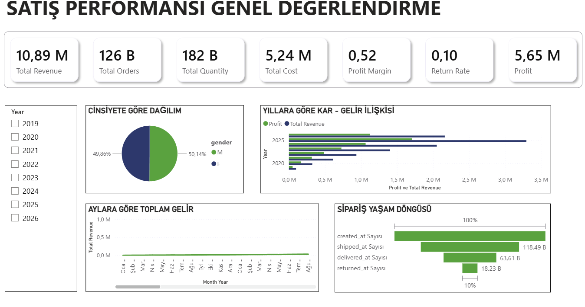

### Customer Analytics
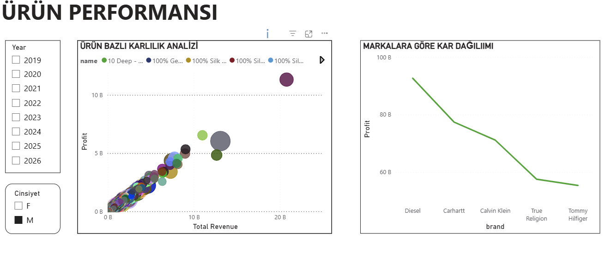

### Sales Performance
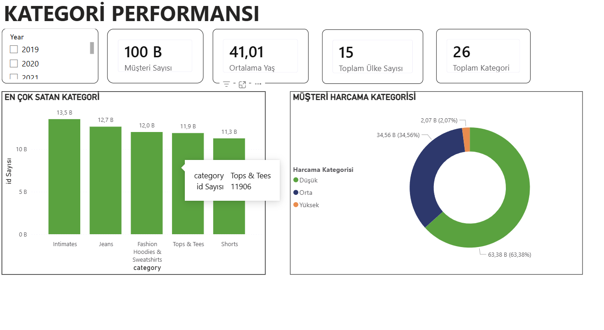

### Category Analysis
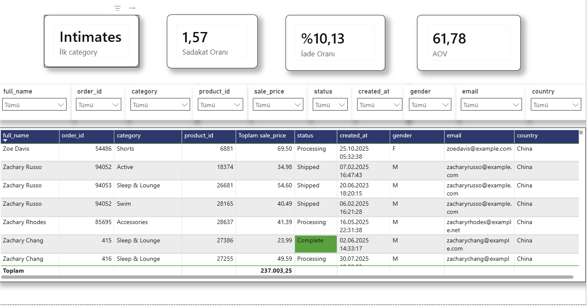

### Customer Spending Analysis
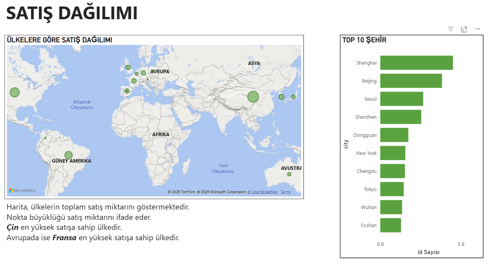

### Inventory Analysis
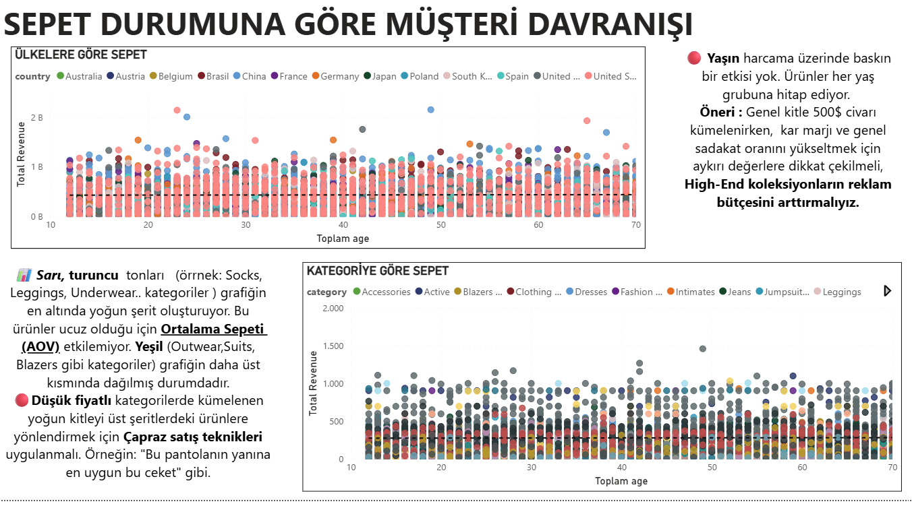

### Marketing Analytics
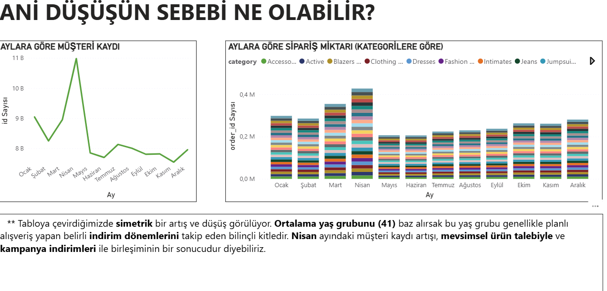

### Geographic Analysis
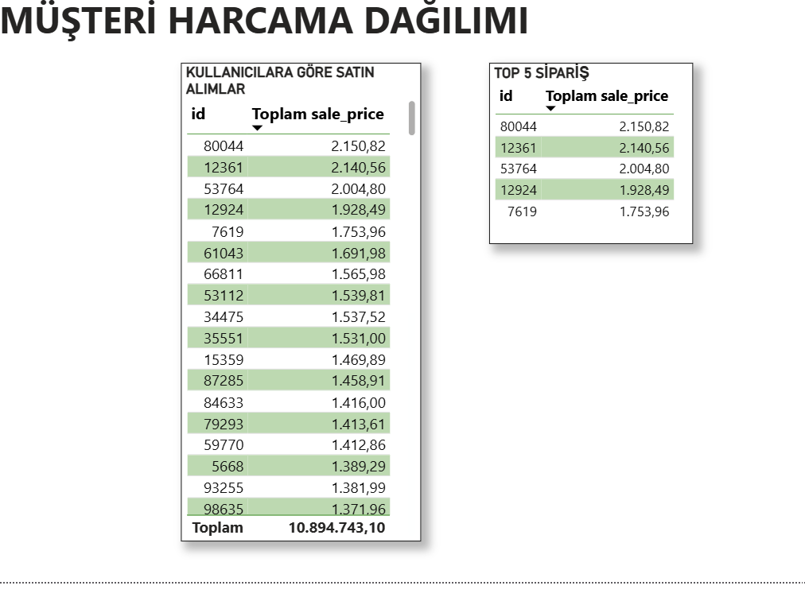

### KPI Monitoring
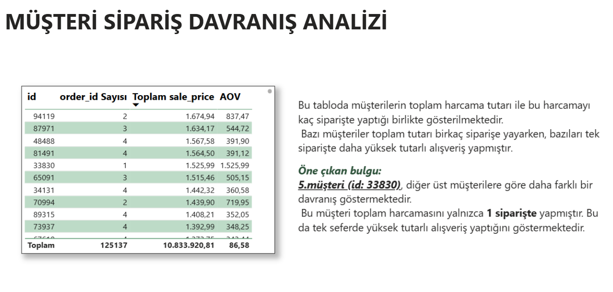

### Business Intelligence Dashboard
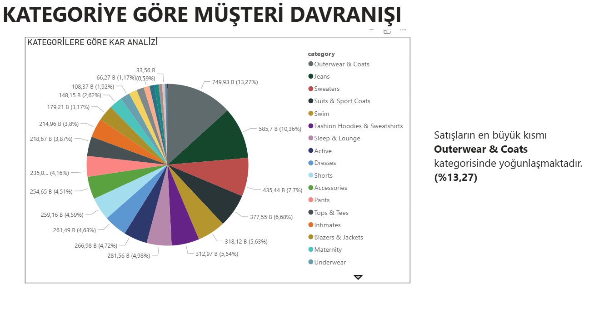

### Additional Insights
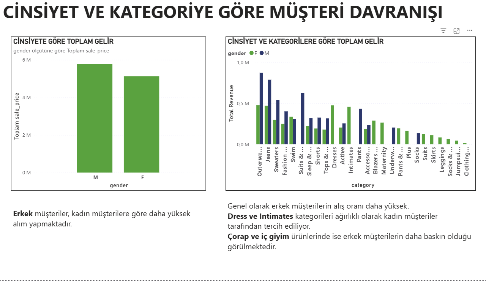

